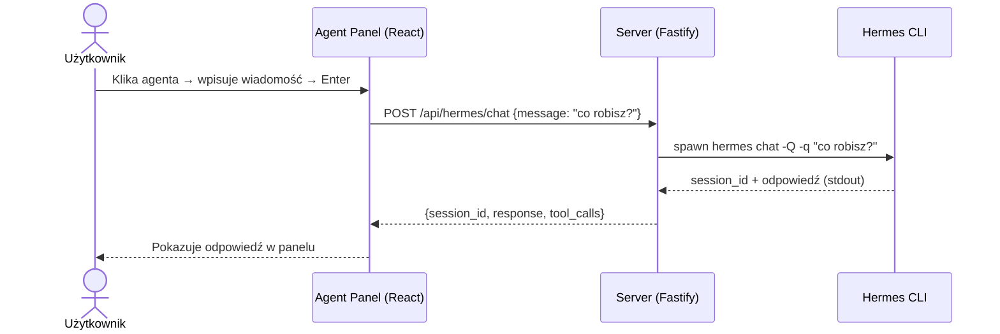
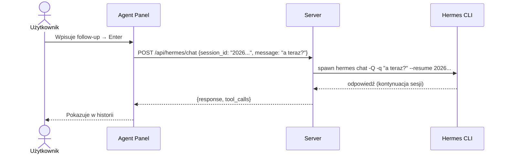
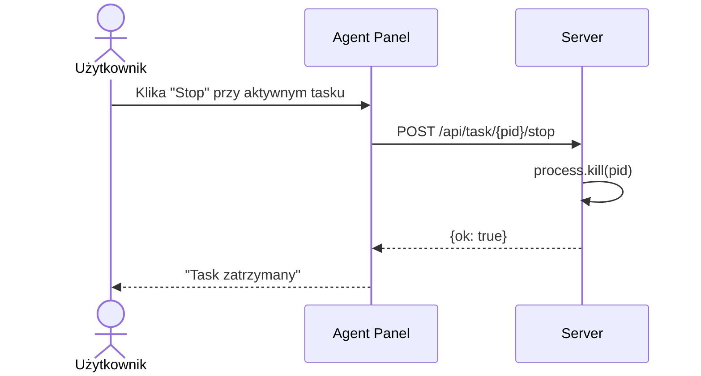

# MVP-3 — Interaktywna kontrola Hermesa (Chat + Zarządzanie)

**Wersja:** 0.2.0
**Data:** 2026-07-26
**Zależność:** MVP-1 (adapter SQLite), MVP-2 (klikalni agenci, panel)

## Cel MVP-3

Dać użytkownikowi pełną, dwustronną komunikację z Hermesem przez interfejs Age of Agents:
- Wysyłanie wiadomości do Hermesa i **otrzymywanie odpowiedzi**
- Prowadzenie **ciągłej konwersacji** (historia sesji)
- **Zatrzymywanie** działających tasków
- **Podgląd live** tego co robi agent (tool calls)

## Procesy biznesowe

### Flow 1: Nowa rozmowa z agentem

### Flow 2: Kontynuacja rozmowy

### Flow 3: Zatrzymanie tasku

## Funkcje MVP-3

| Funkcja | Opis |
|---------|------|
| Chat z odpowiedzią | Wysyłasz wiadomość → dostajesz odpowiedź Hermesa (nie fire-and-forget) |
| Historia konwersacji | Kolejne wiadomości w tej samej sesji przez `--resume` |
| Zatrzymywanie tasków | Przycisk Stop przy aktywnym tasku |
| Podgląd tool calls | W trakcie oczekiwania widać co Hermes robi (search_files, terminal...) |
| Lista aktywnych tasków | Panel pokazuje wszystkie running taski z PID i możliwością stop |