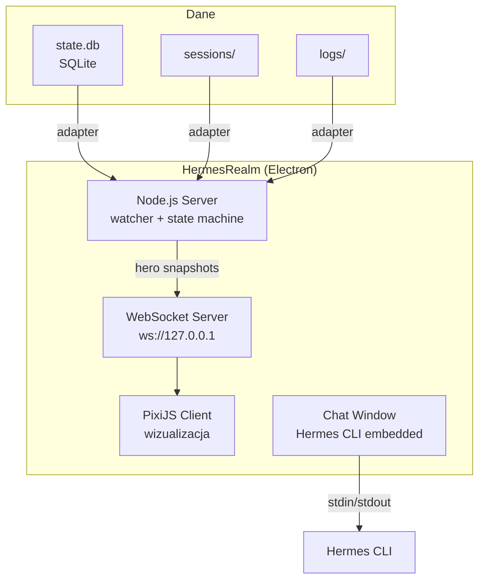

# HermesRealm — Dokumentacja MVP-1

**Wersja:** 0.1.0 (MVP-1)
**Data:** 2026-07-26
**Fork z:** agentsmill/age-of-agents

## Cel MVP-1

Uruchomić Age of Agents z danymi z sesji Hermesa zamiast Claude/Codex + wbudowane okno czatu.

## Architektura

## Adapter danych Hermesa

### Źródło danych: `D:\Hermes\state.db`

| Tabela | Co zawiera | Mapowanie w AoA |
|--------|-----------|-----------------|
| `sessions` | Sesje Hermesa (id, model, message_count, started_at) | Sesja → osadnik (settler) |
| `messages` | Wiadomości (role, content, tool_calls JSON, token_count) | Fakty → maszyna stanów |
| `async_delegations` | Delegacje zadań do subagentów | Subagenci → pracownicy |

### Mapowanie narzędzi Hermesa → warsztaty

| Narzędzie Hermesa | Warsztat w AoA |
|-------------------|----------------|
| `read_file`, `write_file`, `patch`, `search_files` | Kuźnia (kod) |
| `web_search`, `web_extract`, `x_search` | Wieża maga (research) |
| `terminal`, `execute_code` | Kopalnia (terminal) |
| `memory`, `skill_view`, `session_search` | Biblioteka (pamięć) |
| `delegate_task` | Koszary (subagenci) |
| `browser_navigate`, `browser_click` | Targowisko (web) |

### Stany agenta (mapowanie Hermes → AoA)

| Stan Hermesa | Stan AoA | Akcja |
|-------------|----------|-------|
| `role=user` (nowa wiadomość) | `idle` → `thinking` | Osadnik wychodzi z keep |
| `role=assistant` + `tool_calls` | `working` | Osadnik idzie do warsztatu |
| `role=tool` (wynik narzędzia) | `working` | Osadnik kontynuuje |
| `role=assistant` + brak tool_calls | `returning` | Osadnik wraca |
| Sesja `ended_at != null` | `resting` | Osadnik odpoczywa |

## Okno czatu

Tryb "Chat" — proste okno z polem tekstowym wysyłającym do Hermesa CLI:
- Użytkownik wpisuje prompt → wysyła do `hermes` CLI
- Odpowiedź streamuje się w oknie
- W tle sesja jest śledzona i wizualizowana

## Decyzje (ADR)

### ADR-001: SQLite adapter zamiast JSONL watcher
**Decyzja:** Oryginał czyta pliki JSONL. My czytamy `state.db` przez SQLite.
**Powód:** Hermes zapisuje wszystko w SQLite, nie ma transkryptów JSONL.

### ADR-002: Electron zamiast przeglądarki
**Decyzja:** Desktop app przez Electron (nie web app).
**Powód:** Użytkownik chce aplikację desktopową z wbudowanym czatem, a nie dwie osobne rzeczy (przeglądarka + terminal).

### ADR-003: Jeden placeholder motyw na MVP-1
**Decyzja:** MVP-1 używa uproszczonej wersji oryginalnego motywu fantasy.
**Powód:** Nowe motywy to MVP-3+. MVP-1 testuje adapter i czat.