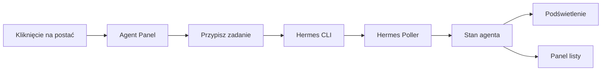

# MVP-2 — Wizualizacja interaktywna

**Cel:** Klikalna wizualizacja z panelem agenta, estymacją czasu i listą aktywnych.

## Zakres

### 1. Klikalni agenci
- Kliknięcie postaci w świecie → otwiera panel szczegółów
- Panel pokazuje: nazwę agenta, stan, aktualne zadanie, tokeny, subagentów

### 2. Panel przypisywania zadań
- W panelu agenta: pole tekstowe "Przypisz zadanie"
- Wpisanie zadania → wysyła do Hermesa jako prompt z kontekstem roli
- Przykład: klikasz "🐝 Pszczoła (Frontend Dev)" → wpisujesz "Popraw button" → Hermes dostaje "Jako senior-frontend-developer: Popraw button"

### 3. Pasek estymacji
- Na podstawie historycznych danych (podobne zadania, ten sam agent)
- Pokazuje: ⏱️ ~45 min ████████░░░░ 68%
- Aktualizuje się w czasie rzeczywistym

### 4. Podświetlenie aktywnych
- Agent w stanie "working" → subtelna poświata/pulsowanie
- Agent w stanie "thinking" → ikona myślenia (💭)
- Agent idle → bez efektu

### 5. Panel aktywnych agentów
- Przycisk/boczny panel: lista wszystkich agentów
- Każdy wiersz: nazwa + stan + pasek postępu
- Kliknięcie → przenosi kamerę na postać

## Architektura

## Pliki do zmiany

| Plik | Zmiana |
|------|--------|
| `client/src/game/unit.ts` | Klikalność + podświetlenie |
| `client/src/hud/agent-panel.ts` | NOWY: panel agenta |
| `client/src/hud/agent-list.ts` | NOWY: lista agentów |
| `client/src/hud/estimation.ts` | NOWY: pasek estymacji |
| `server/src/sdk/sessions.ts` | API do przypisywania zadań |
| `electron/src/main.ts` | IPC: panel → Hermes CLI |