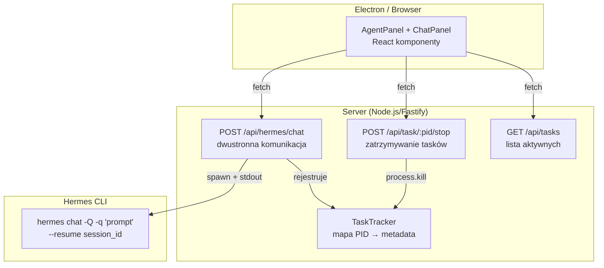

# MVP-3 — Architektura techniczna

**Wersja:** 0.2.0 | **Data:** 2026-07-26

## Architektura



## API — nowe endpointy

### POST /api/hermes/chat

Wysyła wiadomość do Hermesa i zwraca odpowiedź.

**Request:**
```json
{
  "message": "string (wymagane)",
  "session_id": "string (opcjonalne — jeśli podane, używa --resume)"
}
```

**Response (200):**
```json
{
  "ok": true,
  "session_id": "20260726_044201_07a558",
  "response": "Cześć! Hermes gotowy do działania...",
  "tool_calls": [
    {"tool": "search_files", "status": "completed", "summary": "Znaleziono 3 pliki"}
  ],
  "pid": 12345
}
```

**Response (408 — timeout):**
```json
{
  "ok": false,
  "error": "timeout",
  "session_id": "20260726_044201_07a558",
  "partial_response": "Pracuję nad tym...",
  "pid": 12345
}
```

**Implementacja:** `spawn('hermes', ['chat', '-Q', '-q', message, ...resumeArgs])` z timeout 60s. Stdout jest parsowany: pierwsza linia to `session_id: <id>`, reszta to odpowiedź.

### POST /api/task/:pid/stop

Zatrzymuje działający proces Hermesa.

**Response (200):**
```json
{"ok": true, "pid": 12345, "was_running": true}
```

**Response (404):**
```json
{"ok": false, "error": "task not found or already completed"}
```

### GET /api/tasks

Lista aktywnych tasków.

**Response (200):**
```json
{
  "tasks": [
    {
      "pid": 12345,
      "session_id": "20260726_044201_07a558",
      "message": "napraw bug w better-sqlite3",
      "started_at": "2026-07-26T04:42:01Z",
      "elapsed_ms": 15234
    }
  ]
}
```

## Model danych: TaskTracker

Nowa klasa w `packages/server/src/`:

```typescript
interface TrackedTask {
  pid: number;
  sessionId: string;
  message: string;
  startedAt: Date;
  process: ChildProcess;  // referencja do działającego procesu
}

class TaskTracker {
  private tasks: Map<number, TrackedTask>;

  register(pid: number, meta: Omit<TrackedTask, 'pid'>): void;
  get(pid: number): TrackedTask | undefined;
  remove(pid: number): void;
  list(): Omit<TrackedTask, 'process'>[];
  kill(pid: number): boolean;  // process.kill + remove
}
```

## Zmiany w istniejących plikach

| Plik | Akcja | Opis |
|------|-------|------|
| `packages/server/src/server.ts` | EDYCJA | Dodać nowe endpointy: `/api/hermes/chat`, `/api/task/:pid/stop`, `/api/tasks` |
| `packages/server/src/task-tracker.ts` | NOWY | Klasa TaskTracker |
| `packages/client/src/sessions.ts` | EDYCJA | Dodać `chatWithHermes()`, `stopTask()`, `listTasks()` |
| `packages/client/src/hud/agent-panel.tsx` | EDYCJA | Przebudować na panel czatu z historią |
| `packages/client/src/hud/chat-panel.tsx` | NOWY | Komponent czatu (historia + input + tool calls) |

## ADR

### ADR-004: hermes chat -Q -q zamiast interaktywnego trybu

**Decyzja:** Używamy `hermes chat -Q -q "prompt"` (single-query, quiet mode) zamiast interaktywnego `hermes chat`.

**Powód:** Interaktywny tryb Hermesa używa `prompt_toolkit`, który wymaga prawdziwej konsoli Windows (Win32 console buffer) i crashuje z `NoConsoleScreenBufferError` gdy stdin/stdout są pipowane przez Electron. Tryb `-q` działa przez pipe — nie potrzebuje TTY.

**Konsekwencja:** Każda wiadomość to osobny spawn procesu. Żeby utrzymać kontekst rozmowy, używamy `--resume <session_id>`.

### ADR-005: TaskTracker w pamięci (nie w DB)

**Decyzja:** TaskTracker trzyma aktywne taski w `Map<pid, TrackedTask>` w pamięci procesu serwera.

**Powód:** Taski są efemeryczne (żyją max 60s). Nie ma potrzeby persystencji między restartami serwera — po restarcie i tak wszystkie procesy by zginęły.

### ADR-006: Timeout 60s dla odpowiedzi Hermesa

**Decyzja:** 60 sekund timeoutu na pojedynczą odpowiedź Hermesa.

**Powód:** Hermes wykonuje wiele tool calls (search → read → patch → terminal), co regularnie przekracza 30s. 60s daje margines. Przy timeout zwracamy 408 z `partial_response` (to co zdążył wyprodukować).

### ADR-007: Blokada równoległych requestów per sesja (przyszłe)

**Decyzja:** Na razie brak blokady. W przyszłości: `POST /api/hermes/chat` z aktywnym `session_id` zwróci 409 jeśli poprzedni request jeszcze leci.

**Powód:** Dwa równoległe requesty do tej samej sesji (`--resume`) mogą uszkodzić stan sesji. Na MVP-3 ryzyko minimalne (użytkownik nie wysyła dwóch wiadomości jednocześnie).

## Timeouty

| Operacja | Timeout | Zachowanie |
|----------|---------|------------|
| `hermes chat -q` | 60s | Zwraca 408 z partial_response |
| `process.kill` po stop | 5s | SIGTERM → po 5s SIGKILL |